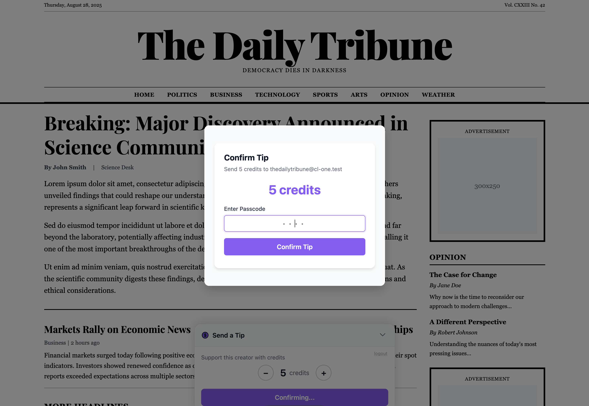

# Stranger Domains
### Embedding your app across the web 

**Nathan Hessler**

Convivial Tech & ExMex Conf

Note:
While I believe I have reasonable claims to some expertise in this area, I'm not claiming to be an expert on every piece of this.

---

## Goal Statement

> Provide a secure, rich, unique, & embedded user experience that includes financial transactions to our customers (users and clients both) through 3rd Party websites.

Note:
We want to provide a solution that allows someone on a content site to tip the publisher and/or purchase products from the publisher directly on their site

---

## Problem #1

> We have to know who the client is and who the customer is to provide the right experience without exposing the wrong data.

Note:
Our clients will have unique data only they should access and the customers on those client sites will have unique data only they should see. And some of that data is financial so everything needs to be secure.

---

## PKCE OAuth2 Flow
#### (PKCE: Proof Key for Code Exchange)

Note:
This is largely a solved problem with OAuth2. The PKCE Oauth2 Flow works well for us,  since we can't guarantee our clients can support other OAuth Flows

---

## PKCE OAuth2 Flow
#### Sequence Diagram


Note:
Here is a Sequence diagram of the PKCE flow and you'll note... There is no client backend server. Part of the security relies on HTTP redirects. Authentication needs to happen on Provider Site. And once Authenticated, we'll be redirected back to the Client site.

---

## Horray for Boruta!

```elixir [7, 8]
  defp deps do
    [
      {:bcrypt_elixir, "~> 3.0"},
      {:phoenix, "~> 1.8.0-rc.3", override: true},
      #...
      {:bandit, "~> 1.5"},
	  {:boruta, "~> 2.3"},
      {:mox, "~> 1.0", only: :test}
    ]
  end
```

Note:
Luckily we don't have to build our own provider code from scratch. There are a few options but I chose Boruta. Downloaded 278k, well documented, working on v3.0. It's pretty well done, but is not plug and play. There is some work to do on your end to integrate boruta that can't be know that in advance.

---

## Boruta & Phoenix 1.8 Gotchas

* Moving Views over to new JSON/HTML modules
* Using scope to fetch current user

Note:
Instructions are generally easy to follow, but you'll spend some time migrating files if you decide to go with Phoenix 1.8

---


---


---

## Problem #2 

> We're embedding our experience on other sites, but we still want to have an app like experience with real-time updates across all of our clients.

Note:
We've solved the first problem of knowing who is asking for what to properly secure the general experience, but we want to also provide an experience that feels snappy and modern.

---

## What Embedded Option To Choose? 

#### Web Components vs iframes

Note:
There are a couple common options for doing embedded experiences on the web. Web Components and iframes

---

## Why Web Components Make Sense 

* 1st class access (same level as site)
* Fewer Content Security Policy(CSP) concerns
* Feels Native "just a custom html element"
* Flexible Styling via custom attributes


Note:
1st class access to JS, localStorage, redirects, **sockets**. no JS postMessage() complexity between iframe and parent window. For our snappy and modern embedded experience this is great!

---

## Hurray for LiveState!

```elixir [7, 8]
  defp deps do
    [
      {:bcrypt_elixir, "~> 3.0"},
      {:phoenix, "~> 1.8.0-rc.3", override: true},
      #...
	  {:boruta, "~> 2.3"}
	  {:live_state, "~> 0.8.0"},
	  {:cors_plug, "~> 3.0"}
    ]
  end
```

Note:
Since we're going with Web Components for our main experience we can't rely on LiveView as there will be no session or pipeline to lean on. We'll be using sockets, but via channels and LiveState to create our snappy & modern embedded experience. we can pass our token in via the socket connection.

---

## Oauth Tokens Over Sockets Gotchas

* Send your token as part of socket initialization
* Monitor token expiration
* PubSub token revocation

```js
this.liveState = new LiveState({
  url: `${wsUrl}/live_state`,
  topic: `tip:user:${tempId}`,
  params: {
	token: token
  }
});
```

Note:
With HTTP requests every request validates the token, but since Sockets are always open, it's easy to validate the token on connection, but don't forget tokens expire and can be revoked so be sure to look for those and disconnect if they happen. 

---


---


---

## Problem #3

> Web Components and Oauth are great!... **until they aren't**. Specifically for financial transactions. We need more security.

Note:
We do eventually have to allow for a financial transaction to take place, but if we just expose a way for a token to do this, then the client could spam that path and drain the users wallet. So how do we secure this?

---

## Why iframes Make Sense

* Complete Isolation
* Unreadable Inputs
* Trusted Origin (Us!)

Note:
Isolation means Different origin = different JavaScript & CSS context. And what happens in the iframe stays in the iframe. the Host page can't just see what's going on. can only communicate via postMessage().

---

## iframe Gotchas

* Don't pass the token in the url
* Site CSP rules can be tricky
* Be careful with information shared via postMessage()

Note:
Site CSP rules could disallow many things in the iframe including socket connections. we'll avoid sockets and rely on standard HTTP controllers for the final confirmation.

---

## Embedded Exprience Gotchas

### Cross Origin Resource Sharing

**(CORS)**

Note:
Wasn't sure where to state this, but it'll be an ongoing battle. setup CORS for static assets, setup CORS for channels, setup CORS for router endpoints. and this is ok, because we want to make sure only the things that were meant to be embedded can be embedded.

---



---

## Problem #4

> So, We have now solved a few technical problems, but how do we bring them together and make sure it's easy for our client customers to integrate it into their site?

Note:
Our client customers are content creators and publishers. not techies. we can't expect them to build an Oauth Client in JS. would they even know what to do with a client ID? They definitely can't orchestrate the web component and iframe aspects of our experience on their own.

---

## Hurray for SDKs!

```html
<!-- Load Provider SDK -->
<script src="https://provider.test/sdk/provider.js"></script>

<!-- Load the Tip Widget -->
<provider-tip></provider-tip>
```

Note:
Why don't we make it easy to cut and paste the right code where it belongs?

---

## SDK Gotchas

* Likely Need for Build Step

Note:
We're using LiveState so we'll want to pull in the js library pxh-live-state as well, and we could potentially use an Oauth Client library as well. we want this to be a self contained experience so we'll need a build step to bring it all together in the JS SDK.

---


---


---

## How Does It All Work Together?

* client "installs" our code on their site
* The Tip Widget is initialized to a login experience
* The user engages the Oauth Flow
* The widget is initialized to a functioning tip widget
* The user selects tip amount & clicks the Tip button
* iframed modal pops up for user confirmation code
* broadcast of change is sent to subscribers 
* change is reflected on all widgets and pages listening

Note:
widget is Oauth aware
iframe completes the transaction

---

## What Does It Look Like?

**Demo Time**

---

## The End?

**Hot Take or Questions?**

---


## 🔥localhost considered harmful🔥

Note:
Lets end this with a Hot Take

---

## Setup a local reverse proxy

* Required for this talk
* Useful for every project
* supports https
* It's easy to do!
* If that's the problem, you can make it hard!

Note:
If you're a dev, do yourself a favor

---

## How To Do It 
#### steps 1 & 2

* Brew install and setup Caddy
* Brew install and setup dnsmasq
  *  use .test 

Note:
Don't forget to run caddy command to setup https support
*(it's silly but standards compliant)*

---

## How To Do It 
#### step 3

**Caddyfile**

```config [2-5]
...
provider.test {
	tls internal
	reverse_proxy localhost:4001
}

cl-one.test {
	tls internal
	reverse_proxy localhost:4011
}

cl-two.test {
	tls internal
	reverse_proxy localhost:4012
}
```

Note:
 Add project to your Caddy file, and make sure to use a port that's not already used

---

## How To Do It 
#### step 4

**config/dev.exs**

```elixir [1,2,6]
# Development URL configuration for provider.test domain
host = System.get_env("PHX_HOST") || "localhost"

config :provider, ProviderWeb.Endpoint,
  #...
  url: [host: host, port: 443, scheme: "https"],
  # Binding to loopback ipv4 address prevents access from other machines.
```

Note:
You can hardcode the HOST if you're solo deving or everyone agrees to a domain

---

## And... Bob's Your Uncle

```shell
~/Projects/nhessler/provider
❯ PHX_HOST="provider.test" PORT=4001 mix phx.server
```

Note:
You can also hardcode the port if you like. or use direnv or whatever you'd like to store your local ENV settings

---

## Why Is This Useful?

* Browsers see domains as separate
* closer to production
* everything can be run locally


Note:
Why is this important?
provider.test & client.test are not the same
localhost:4000 & localhost:4001 are the same
cookies/sessions stored separately
no staging envs required

---

## The End!

**Thank You**

---

## GemFriends 

**$25** Promo Code 

valid until **9/30 @ 12pm CT**
